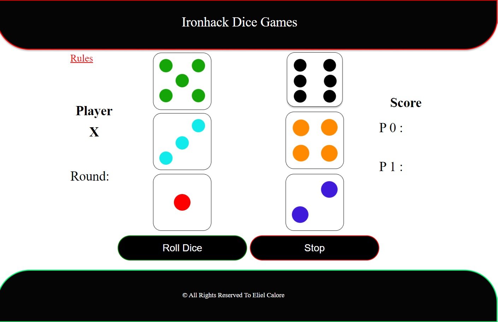

Dice Games

Simple game developed with DOM manipulation in pure Javascript Vanilla, HTML5 and CSS3, with most of the basic functionality dedicated in the dices.js file, styles and animations are in styles.css, and DOM manipulation are in script.js.

This project is part of Ironhack's FullStack Web Development Bootcamp. For our first independent project, we were given the task of creating our own authorial game using the knowledge acquired during the first two weeks of the course.

F
